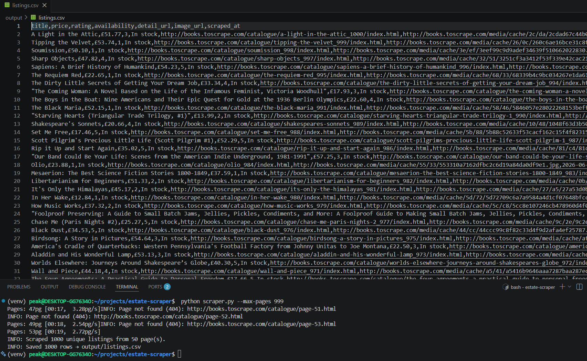

# estate-scraper

A configurable, concurrent Python scraper that extracts paginated listing cards from any card-grid site and exports clean, deduplicated data to CSV or JSON.

---

## Demo



---

## Sample output

```
title,price,rating,availability,detail_url,image_url,scraped_at
A Light in the Attic,£51.77,3,In stock,http://books.toscrape.com/catalogue/a-light-in-the-attic_1000/index.html,http://books.toscrape.com/media/cache/2c/da/2cdad67c44b002e7ead0cc35693c0e8b.jpg,2026-06-22T20:08:50.587632+00:00
Tipping the Velvet,£53.74,1,In stock,http://books.toscrape.com/catalogue/tipping-the-velvet_999/index.html,http://books.toscrape.com/media/cache/26/0c/260c6ae16bce31c8f8c95daddd9f4a1c.jpg,2026-06-22T20:08:50.587821+00:00
Soumission,£50.10,1,In stock,http://books.toscrape.com/catalogue/soumission_998/index.html,http://books.toscrape.com/media/cache/3e/ef/3eef99c9d9adef34639f510662022830.jpg,2026-06-22T20:08:50.588006+00:00
Sharp Objects,£47.82,4,In stock,http://books.toscrape.com/catalogue/sharp-objects_997/index.html,http://books.toscrape.com/media/cache/32/51/3251cf3a3412f53f339e42cac2134093.jpg,2026-06-22T20:08:50.588170+00:00
```

---

## Features

- **Config-driven selectors** — point the engine at any permissive listings site by editing `config.py`; no code changes required.
- **Automatic pagination** — follows the "next" link up to `--max-pages` pages, stopping early when the last page is reached.
- **Concurrent fetching** — `ThreadPoolExecutor` fetches multiple pages in parallel while each worker thread still honors `--delay`.
- **Polite by default** — 1 s delay between requests, honest `User-Agent` header, and `robots.txt` compliance check before scraping.
- **Retry with back-off** — up to 3 attempts per page with exponential back-off on network errors.
- **Deduplication** — rows are keyed on `detail_url`; duplicates across overlapping pages are silently dropped.
- **tqdm progress bar** — live page-level progress; suppressed with `--quiet`.
- **CSV and JSON output** — `output/` directory is created automatically.

---

## Install

```bash
git clone https://github.com/yourname/estate-scraper.git
cd estate-scraper

python -m venv venv
source venv/bin/activate       # Windows: venv\Scripts\activate

pip install -r requirements.txt
```

---

## Usage

Run with all defaults (5 pages → `output/listings.csv`):

```bash
python scraper.py
```

### CLI flags

| Flag | Default | Description |
|------|---------|-------------|
| `--max-pages N` | `5` | Number of catalogue pages to scrape |
| `--output PATH` | `output/listings.csv` | Output file path |
| `--format csv\|json` | `csv` | Output format |
| `--delay SECONDS` | `1.0` | Polite pause between requests per worker thread |
| `--workers N` | `4` | Concurrent fetcher threads |
| `--quiet` | off | Suppress the progress bar |

### Examples

```bash
# Scrape all 50 pages and save as CSV
python scraper.py --max-pages 50

# First 10 pages as JSON
python scraper.py --max-pages 10 --format json --output output/books.json

# Slower, single-threaded, silent (CI-friendly)
python scraper.py --max-pages 5 --workers 1 --delay 2.0 --quiet

# Fast local test — 2 pages, minimal delay
python scraper.py --max-pages 2 --delay 0.5 --workers 2
```

---

## Configuration

All site-specific settings live in [config.py](config.py). To target a different site:

1. Update `BASE_URL` and `START_PAGE`:

```python
BASE_URL   = "https://example-listings.com"
START_PAGE = "https://example-listings.com/search?page={page}"
```

2. Update `SELECTORS` to match the new site's HTML:

```python
SELECTORS = {
    "card":         "div.listing-card",
    "title":        "h2.listing-title",   # read inner text, not an attribute
    "price":        "span.price",
    "rating":       None,                 # no rating on this site
    "availability": "span.status",
    "image":        "img.listing-thumb",
    "next_page":    "a.pagination-next",
}
```

3. Adjust `RATING_MAP` or set ratings to `None` if the target site uses a different scheme.

No changes to `scraper.py` are needed.

---

## Ethics & compliance

- **robots.txt** — the scraper reads the target site's `robots.txt` before making any requests and logs a warning if scraping is disallowed. Proceeding against a disallow directive is your responsibility.
- **Rate limiting** — `--delay` (default 1 s) is enforced per worker thread. Do not set `--delay 0` on production sites.
- **User-Agent** — the scraper identifies itself honestly; it does not spoof a browser.
- **No personal data** — the fields collected (title, price, rating, stock status, URLs) contain no personally identifiable information.
- **Terms of service** — always verify that a site's ToS permits automated scraping before running this tool against it. `books.toscrape.com` is an explicitly provided sandbox for scraper practice.

---

## License

MIT — see [LICENSE](LICENSE).
